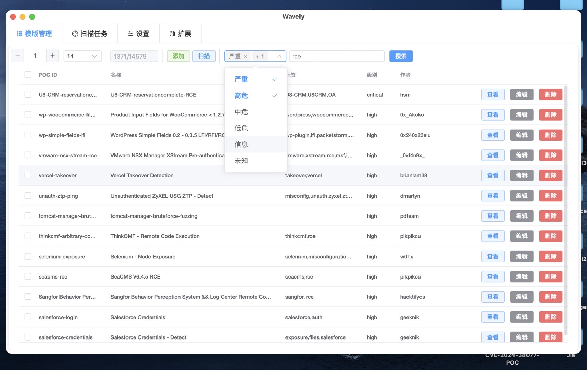
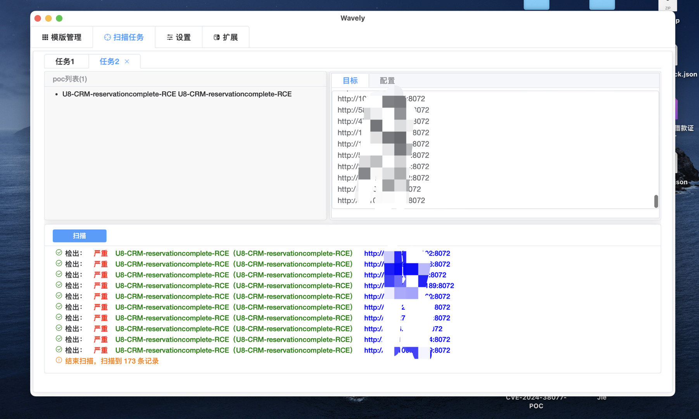
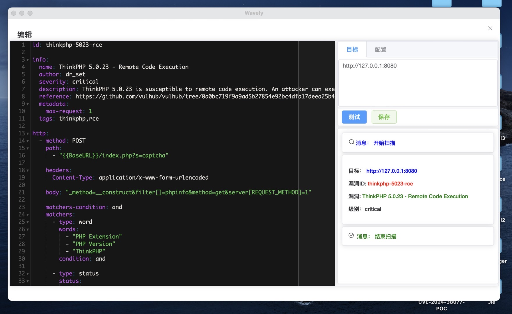

## wavely
## nuclei模版管理工具

### POC管理器
- 实现nuclei poc管理的桌面应用
- 支持`MacOS`、`Windows`和`Linux`操作系统
- 使用nuclei v3检测引擎
- 兼容yamlv2和yamlv3 nuclei template
- 实现多任务、并行扫描

### 图
- 模版管理

- 扫描

- 编辑

## 关于

邮箱：hsmcool@qq.com