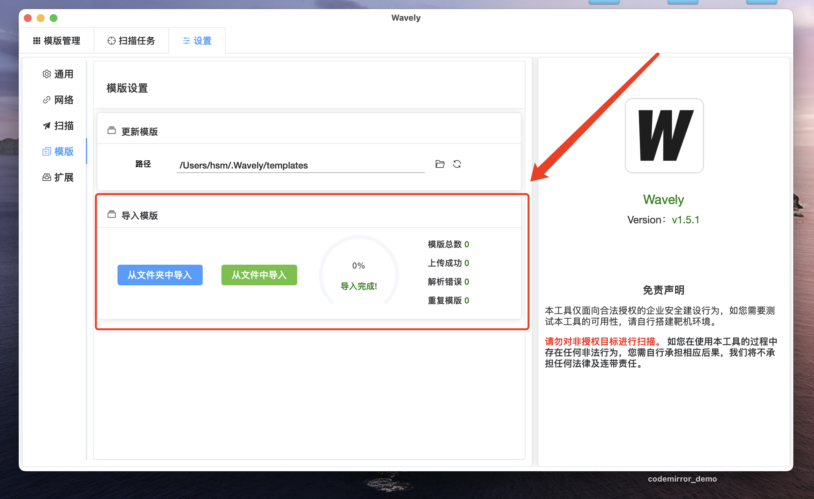
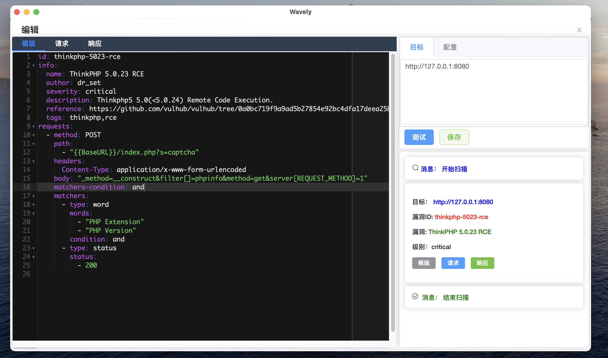
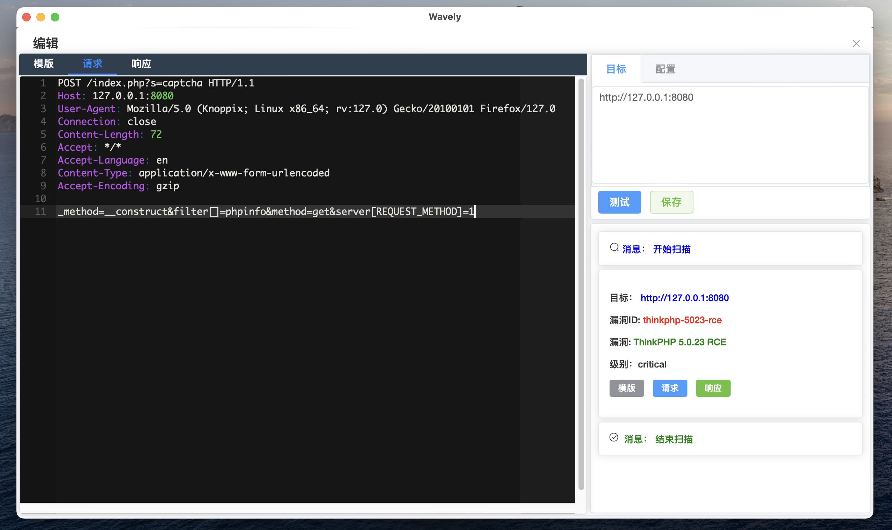
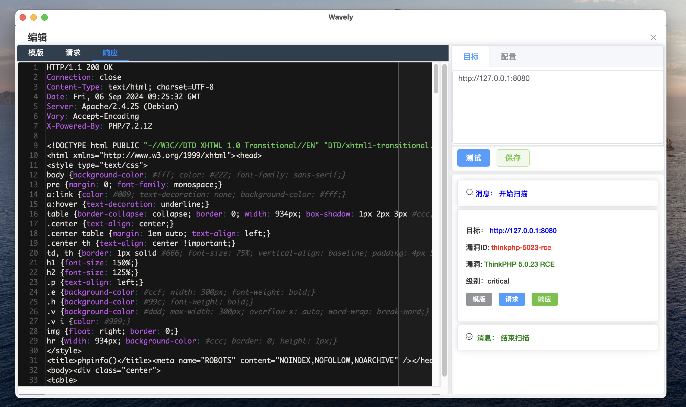
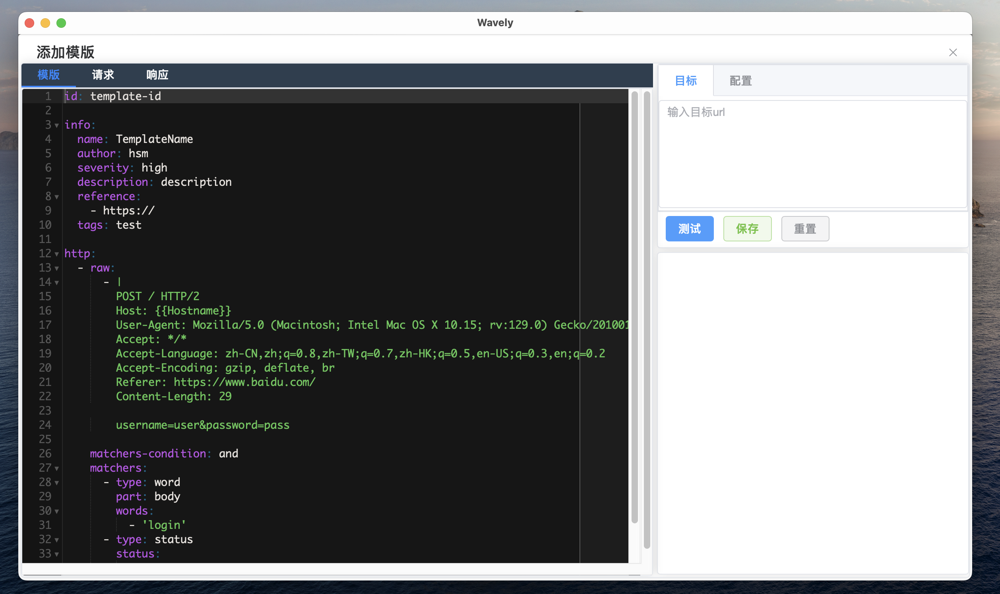
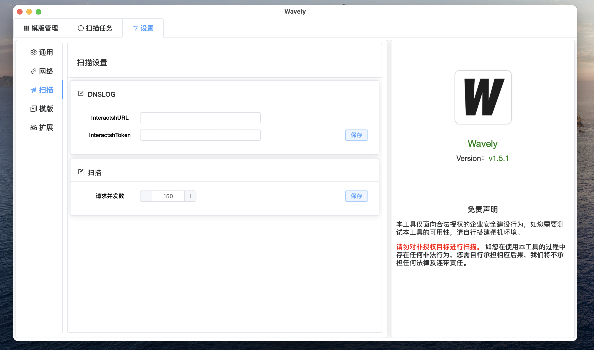
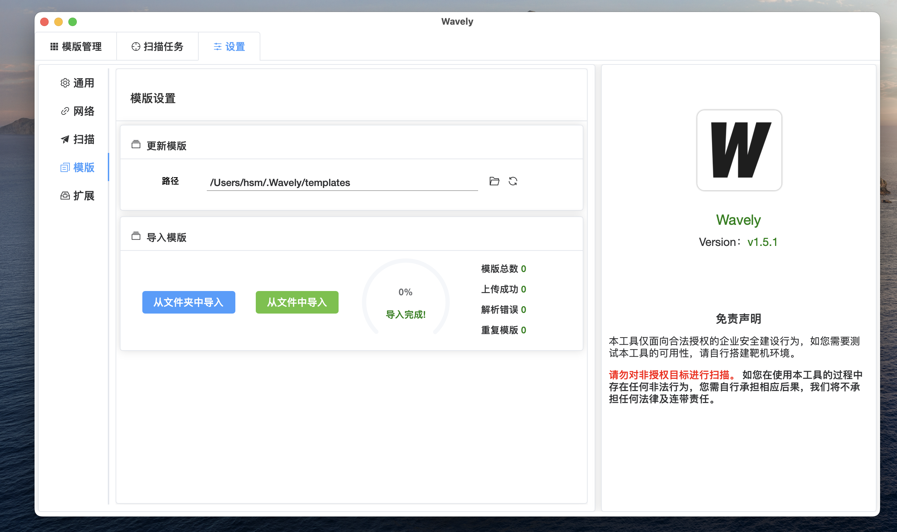

## wavely
## nuclei模版管理工具
由于没找到一款比较好用的poc管理器，便自己开发了这个，目前仅提供安装包下载。


## ✨ 功能
- [x] 实现nuclei poc管理的桌面应用，对nuclei模版的增删查改操作
- [x] 支持查看nuclei模版请求响应包
- [x] 支持`MacOS`、`Windows`和`Linux`操作系统
- [x] 使用全新`nuclei v3`检测引擎
- [x] 兼容`yamlv2`和`yamlv3` nuclei template
- [x] 实现多任务、并行扫描
- [x] 支持自定义nuclei DNSLOG服务器
- [x] 支持`http代理`（http、https、socks5）
- [x] 支持主题切换
- [x] 支持多种nuclei模版导入方式
- [x] 基本支持简体中文和英文

### 后续实现

- [ ] App设置-配置持久化生效
- [ ] 显示扫描进度
- [ ] POC导出功能

# 快速使用

## POC模版导入

### POC模版保存路径
#### 1. macos
对于MacOS和Linux，首次打开App会在家目录生成模版文件夹
``` bash
ls /Users/$USER/.wavely/templates # macos
ls /home/$USER/.wavely/templates    # linux
```
#### 2. windows
会在wavely.exe的同级目录下创建`.wavely/templates`，将POC放入此文件夹中（请开启显示隐藏文件/文件夹）。


### POC导入
#### 1. 在App中导入POC（带POC去重）
- 点击`从文件夹中导入`按钮，选择`nuclei poc文件目录`。



#### 2. 手动导入POC（不带POC去重）
1. 打开 `Wavely`，将初始化数据库和poc配置目录。
2. 将nuclei poc文件复制到以下文件夹中：
    - **MacOS**：/Users/$USER/.wavely/templates
    - **Windows**：.wavely/templates
3. 打开 `Wavely`，进入**设置**->**模版**->点击**更新按钮图标**。

> 注意：首次打开App将初始化数据库和POC保存路径


## 功能展示
##### 模版管理


##### 扫描任务
- 选择thinkphp的poc进行扫描


##### 扫描结果
- 扫描结果
- 可复制扫描结果


####  编辑nuclie模版
- 编辑模版



- 匹配请求包（需扫描匹配POC成功时才可看到请求响应包）



- 匹配响应包（需扫描匹配POC成功时才可看到请求响应包）



#### 添加Nuclei模版


### App设置
- 切换POC编辑器主题


- 添加HTTP代理


- POC扫描参数设置



- 模版导入功能



## 常见问题
####  Macos 无法打开App
由于没有使用apple证书签名app，故不能正常打开，需要手动允许App允许，请参考：
执行如下命令即可：
``` bash
chmod 755 /Users/$USER/Desktop/Wavely_darwin_arm64_1.5.2.app/Contents/MacOS/Wavely
```

# 免责声明
本工具仅面向合法授权的企业安全建设行为，如您需要测试本工具的可用性，请自行搭建靶机环境。 为避免被恶意使用，本项目所有收录的poc均为漏洞的理论判断，不存在漏洞利用过程，不会对目标发起真实攻击和漏洞利用。 在使用本工具进行检测时，您应确保该行为符合当地的法律法规，并且已经取得了足够的授权。请勿对非授权目标进行扫描。 如您在使用本工具的过程中存在任何非法行为，您需自行承担相应后果，我们将不承担任何法律及连带责任。

# 捐赠
如果 Wavely 对您帮助很大，您可以通过以下方式支持我们：

### 赞赏码赞助
