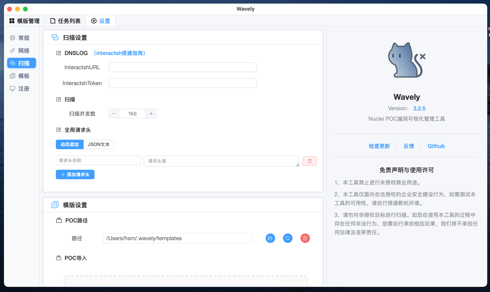
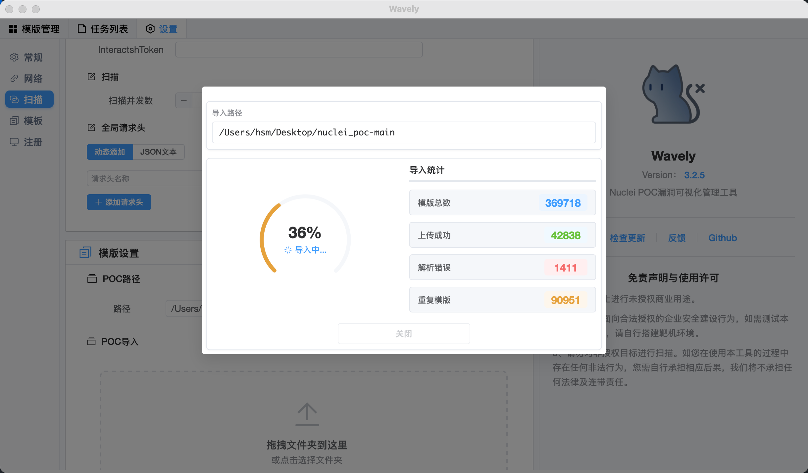
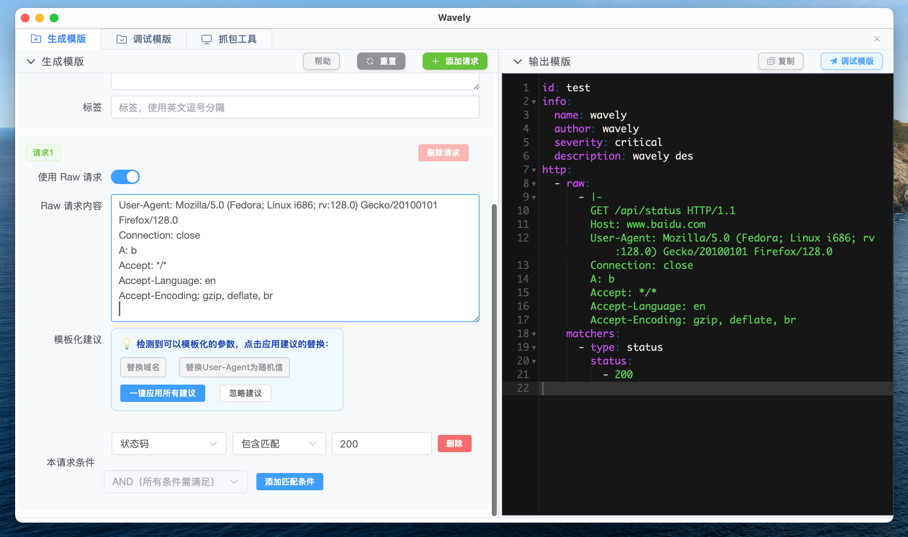
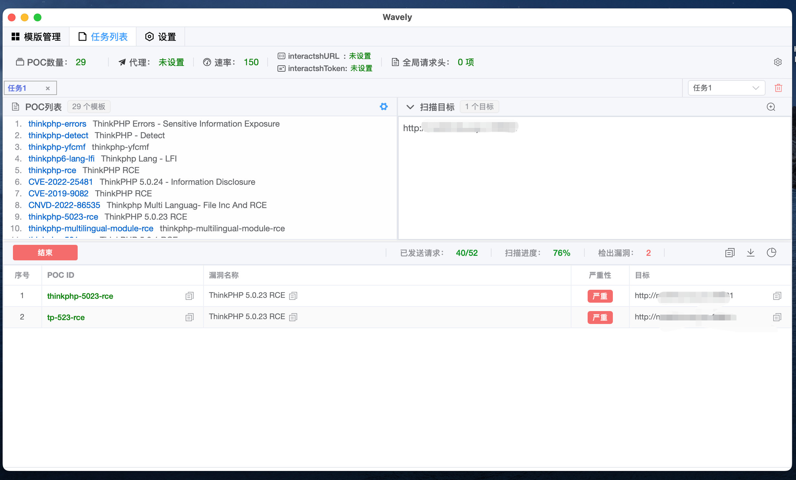
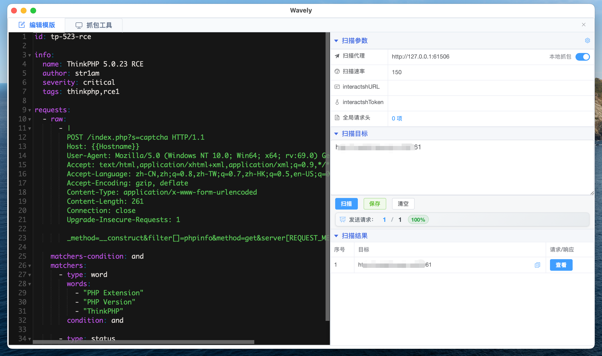
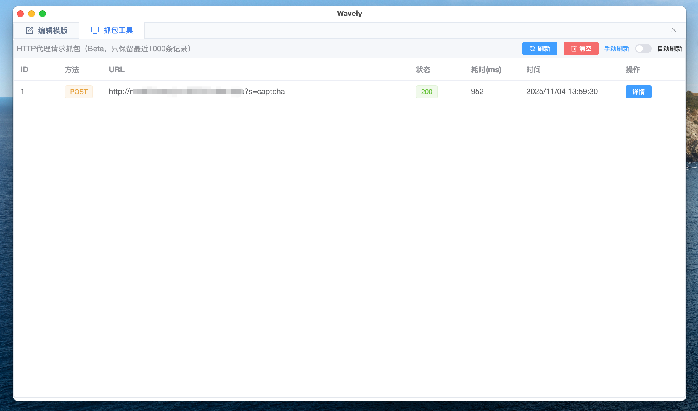
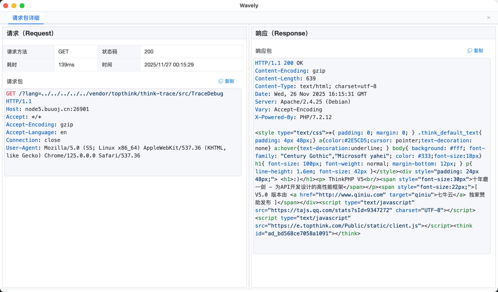
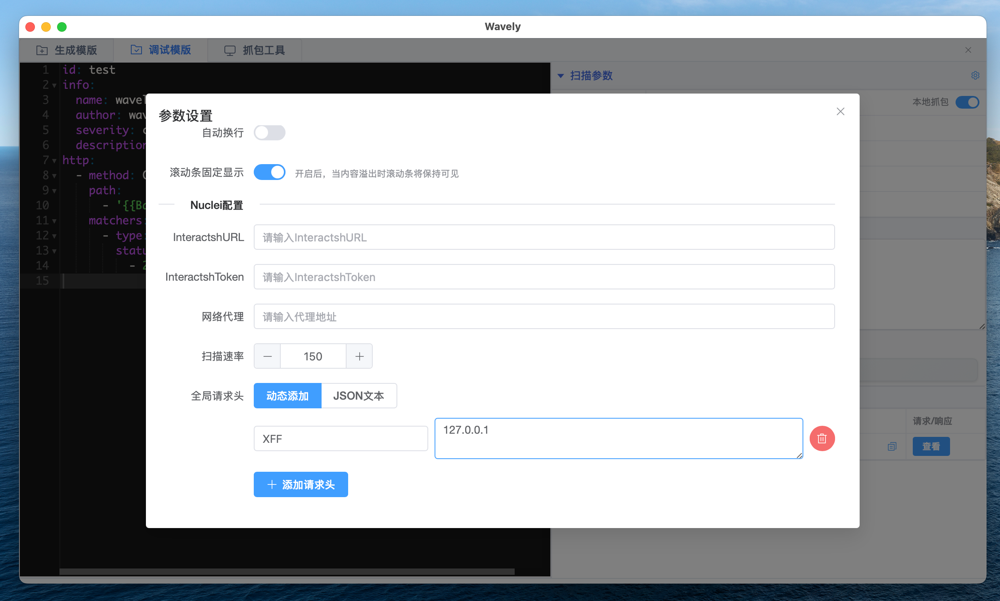
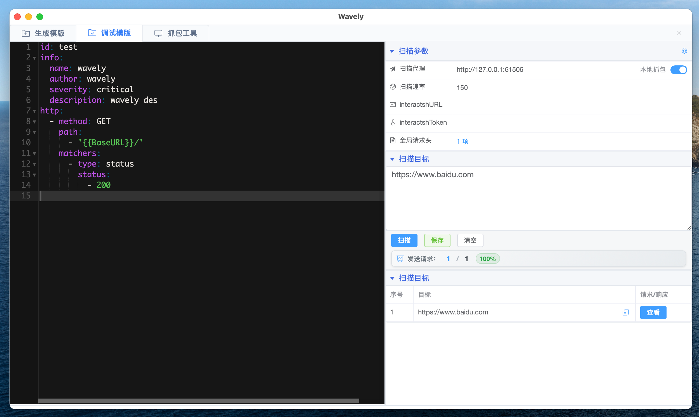
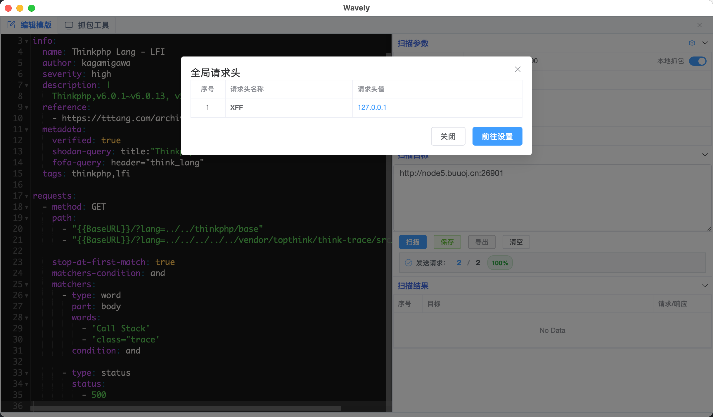

# 🌊 Wavely — Nuclei POC 管理与漏洞验证工具
🔍 一款面向安全研究人员的本地化 POC 管理与漏洞验证平台，支持自定义 POC、抓包调试、全局请求头配置等功能。


[](https://star-history.com/#perlh/wavely&Date)
 
- 详细安装与激活方法请参阅：[Wavely 官方 Wiki](https://github.com/perlh/Wavely/wiki)

## ✨ 功能一览
- [x] **POC 模板管理**：支持对 Nuclei POC 模板的增删查改操作
- [x] **跨平台兼容**：已支持 macOS 和 Windows 系统，Linux 版本测试中
- [x] **多任务扫描**：支持多 POC、多目标批量扫描
- [x] **高级配置**：支持自定义 DNSLog 服务器、扫描速率控制及 HTTP/HTTPS/SOCKS5 多协议代理
- [x] **请求分析**：支持查看 POC 匹配时的完整请求/响应数据包
- [x] **编辑器优化**：POC 编辑器支持主题切换和字体大小调整
- [x] **模板导入**：支持一键导入 Nuclei 模板，基于 Template ID 自动去重
- [x] **任务控制**：支持手动停止扫描任务，灵活掌控测试流程
- [x] **配置持久化**：自动保存用户配置，下次启动无需重复设置参数
- [x] **API 测试**：支持对 API 接口及带目录路径的目标进行扫描
- [x] **POC 生成**：提供图形化界面辅助生成简单 POC
- [x] **扫描进度实时显示**：提供可视化进度条展示当前扫描状态
- [x] 扫描结果导出
- [x] **POC 导出**（批量导出） v3.1.7
- [x] **POC 生成优化**：Raw 格式下自动解析模板结构 v3.1.8
- [x] **全局请求头**：支持配置全局请求头（如 Cookie 等） - v3.2.3
- [x] **内置 POC 抓包**：集成抓包工具，可对扫描请求实时抓包，便于 POC 调试 v3.2.3
- [x] **新增高级搜索、重载 POC 功能** v3.2.4
- [x] **新增POC 编辑/添加时可折叠参数、目标与结果面板** v3.2.4  
- [x] **新增任务列表支持增删已选 POC** v3.2.4  
- [x] **新增支持拖拽 YAML 文件或 POC 文件夹快速导入** v3.2.4  
- [x] **新增任务列表支持导出扫描统计报告**（Beta，docx 格式）v3.2.4  
- [x] **新增POC 编辑器支持 YAML 语法检查** v3.2.4


## 📦 安装指南
💡 提示：关于使用与安装的常见问题，请参阅文末 [常见问题](#常见问题) 部分。

### 🍏 macOS（安装 / 更新）

-  将 Wavely.app 拖入 Applications 文件夹
-  打开**终端**，执行以下命令解除系统隔离属性：

```bash
sudo xattr -d com.apple.quarantine /Applications/Wavely.app
```

### 🪟 Windows（安装 / 更新）

- 下载最新压缩包并解压
- 运行 Wavely-windows-installer.exe 完成安装

### 🌐 DNSLog 配置说明
- 默认使用 Nuclei 官方 Interactsh 服务（无需额外配置）
- 如需使用私有 DNSLog 服务器，请参考官方搭建指南：
👉 [Interactsh 搭建文档](https://github.com/projectdiscovery/interactsh)

### 🔑 许可证（License）管理
✨ **软件升级或更新 不会导致许可证丢失！**

但请注意：
> - 系统重装、设备迁移等操作可能清除授权文件
> - 请务必提前备份 license 文件

#### 📍 License 文件位置

|平台 |路径|
|-|-|
|macOS / Linux| ~/.wavely/license|
|Windows| 与 Wavely.exe 同级目录下|


> ❗ 重要：该文件是您唯一的本地授权凭证，一旦丢失将无法自动恢复。如不慎遗失，请通过邮箱联系开发者。

## 🚀 基本使用
### 🔐 2.1 激活注册
- 请参考官方激活说明文档：
🔗 [Wavely 激活指南](https://github.com/perlh/Wavely/wiki)

### ➕ 2.2 导入 POC（v3.2.4+）
- 将包含 POC 的文件夹直接拖拽至主窗口，即可自动批量导入！




### ✏️ 2.3 添加 POC

### ✏️ 2.4 编辑 POC


### 🕵️ 2.5 抓包工具
- 编辑模板


- 抓包管理



- 抓包详情



### 🌐 2.6 全局请求头
- 配置界面




- 详细设置




## ❓ 常见问题
### ❓ Windows 启动时闪现命令框？
✅ 正常现象，不影响功能，可放心使用。
### ❓ macOS 无法打开 App？
因未使用 Apple 官方证书签名，可能出现以下提示：
- “已损坏，无法打开”
- “无法验证开发者身份”
- App 图标显示禁止符号

##### ✅ 解决方案：

方案一（推荐）：移除隔离属性
```bash
sudo xattr -d com.apple.quarantine /Applications/Wavely.app
```
方案二：修复执行权限
```bash
chmod 755 /Applications/Wavely.app/Contents/MacOS/Wavely
```
## ⚠️ 免责声明

本工具仅面向合法授权的企业安全建设行为，如您需要测试本工具的可用性，请自行搭建靶机环境。 
- 为避免被恶意使用，本项目所有收录的poc均为漏洞的理论判断，不存在漏洞利用过程，不会对目标发起真实攻击和漏洞利用。 
- 在使用本工具进行检测时，您应确保该行为符合当地的法律法规，并且已经取得了足够的授权。
- 请勿对非授权目标进行扫描。 如您在使用本工具的过程中存在任何非法行为，您需自行承担相应后果，我们将不承担任何法律及连带责任。

## ❤️ 支持我们

如果 Wavely 对您的工作有所帮助，欢迎通过赞赏支持开发！
微信赞赏码
<div align="center">

</div>
您的支持是我们持续维护和迭代的动力！感谢每一位用户 🙏

📌 项目地址：[github.com/perlh/Wavely](https://github.com/perlh/Wavely)
📩 反馈 & 激活问题：id_0909186@foxmail.com
