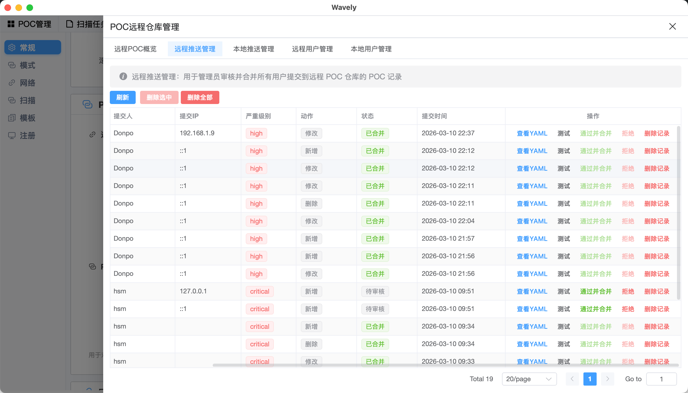
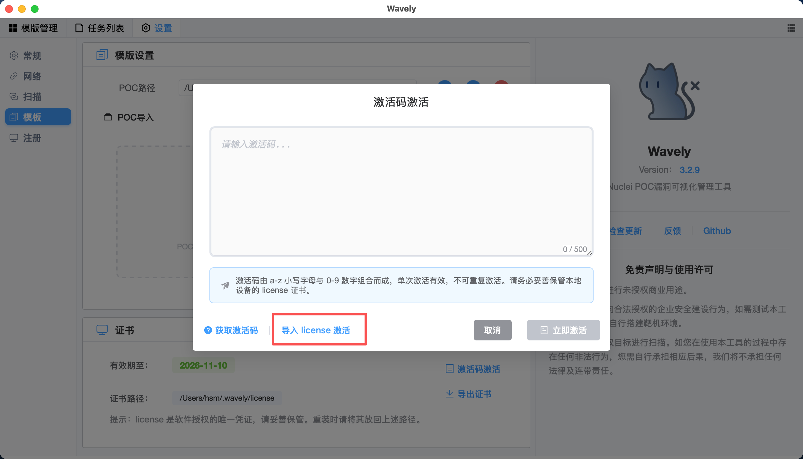
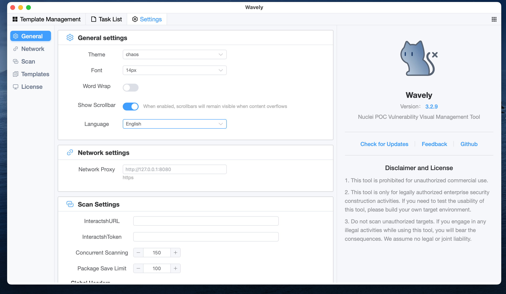

# Wavely — Nuclei POC 管理与漏洞验证工具

🔍 面向安全研究人员的本地化 POC 管理与漏洞验证平台。

[README](./README_en.md) | [中文文档](./README.md)


> 支持自定义模板、批量扫描、抓包调试、全局请求头等能力，帮助你更高效地验证与复现漏洞；同时支持团队协同管理 POC、远程共享 POC、远程接入 POC 库。




 
- 详细安装与激活请参阅：[Wavely 官方 Wiki](https://github.com/perlh/Wavely/wiki)

## ✨ 功能一览
- [x] 团队协作：支持 POC 共享与远程 POC 仓库接入（v3.3.0及以上）
- [x] POC 模板管理：增删查改、导入去重（基于 Template ID）
- [x] 多任务扫描：支持多 POC、多目标批量运行，可手动停止任务
- [x] 请求分析与调试：完整请求/响应查看、内置抓包、HTTP 请求重放
- [x] 编辑器体验：主题切换、字体大小调整、YAML 语法检查、Raw 自动解析
- [x] 高级配置：自定义 DNSLog、扫描速率控制、HTTP/HTTPS/SOCKS5 代理、请求超时
- [x] 搜索与过滤：关键词组合搜索、基于 tag/author 的分组过滤、高级搜索与重载
- [x] 导入与导出：拖拽 YAML/POC 文件夹快速导入、批量导出 POC、导出扫描统计报告（xlsx、docx）
- [x] 配置持久化：自动保存用户配置，下次启动无需重复设置
- [x] API 测试：支持对接口及带目录路径的目标进行扫描
- [x] 扫描进度与结果：可视化进度展示，支持结果导出
- [x] 跨平台兼容：macOS 与 Windows 已支持，Linux 版本测试中
- [x] 国际化：支持简体中文与英文


## 1、安装指南
💡 提示：关于安装与使用的常见问题，请参阅文末的[常见问题](#常见问题)部分。

### 首次安装
#### macOS
- 将 `Wavely.app` 拖入「Applications / 应用程序」文件夹
- 打开终端执行以下命令以移除系统隔离属性：

```bash
sudo xattr -d com.apple.quarantine /Applications/Wavely.app
```

#### Windows
- 下载最新压缩包并解压
- 运行 `Wavely-windows-installer.exe` 完成安装

**版本升级**
- macOS：拖动 `Wavely.app` 覆盖旧的 `Wavely.app` 即可
- Windows：用新的 `Wavely.exe` 覆盖旧的 `Wavely.exe` 即可


## 2、使用说明

### 🔐 激活注册
- 🔗 [激活码获取入口](https://github.com/perlh/Wavely/wiki)

激活码仅限使用一次。激活成功后会在本地生成 `license` 文件，该文件即为本机专属的激活密钥。**请妥善保管你的 license。**


| 平台 | 路径 |
|---|---|
|macOS / Linux| ~/.wavely/license |
|Windows| 与 Wavely.exe 同级目录下|


如你之前购买过 Wavely，可直接导入 `license` 文件进行激活：



### DNSLog 配置说明
- 默认使用 Nuclei 官方 Interactsh 服务（无需额外配置）
- 如需使用私有 DNSLog，请参考官方搭建指南：
👉 [Interactsh 搭建文档](https://github.com/projectdiscovery/interactsh)


## 3、基本使用

#### 3.1 中英文切换


#### 3.2 导入 POC
- 将包含 POC 的文件夹直接拖拽至主窗口，即可批量导入


#### 3.3 添加 POC


#### 3.4 编辑 POC


#### 3.5 任务列表


#### 3.6 抓包工具
- 抓包管理


- 抓包详情


#### 3.7 请求包重放


#### 3.8 全局请求头
- 配置界面


- 详细设置


#### POC 共享服务
- 用于将本机 POC 通过服务方式共享给团队中其他使用 Wavely 的成员，便于统一维护和复用 POC。
- 开启共享服务后，本机将作为「POC 服务端」，其他成员可通过「POC 接入管理」添加并使用本机提供的 POC 库。

1. **在 Wavely 客户端开启共享服务**
   - 在主界面打开「POC 共享服务」入口，勾选或点击开关启用服务。
   - 设置对外暴露的监听地址与端口（如 `0.0.0.0:8081`，或仅绑定内网 IP）。
   - 可选择共享的 POC 范围（全部 POC、指定标签、指定作者等），避免将实验性或敏感 POC 暴露给所有人。

   

2. **通过 `Wavely-server` 运行 POC 共享服务（可选）**
   - 可运行命令行版 `Wavely-server` 作为 POC 共享服务端（适用于服务器部署或无人值守场景），支持 Windows / macOS / Linux。
   - 建议在内网环境使用，并通过防火墙或网段控制访问范围。
   - 如需限制访问者，可配置访问密钥/令牌，仅允许已授权客户端接入。
   - 关闭共享服务后，现有连接将自动失效，其他客户端将无法继续同步 POC。

   

#### POC 接入管理（客户端连接远程 POC 服务）

1. **添加远程 POC 服务**
   - 点击「设置」→「模式」→「POC 管理」，进入「POC 接入管理」页面。
   - 点击「新增服务 / 添加节点」，填写远程服务地址（如 `http://192.168.1.10:8081`）与访问密钥（如有）。
   - 启用后连接成功，右上角会显示「远程仓库：xxxx」。
   - 远程 POC 服务管理：点击右上角用户图标进入「用户管理」页面。

   

2. **用户管理模块说明**
   - **远程 POC 概览**：远程与本地 POC 库概览；支持将远程 POC 合并到本地、下载远程 POC 库等。
   - **提交管理**：普通用户的提交记录与审核状态（例如新增/修改 POC 的申请是否通过）。
   - **远程推送管理**：远程 POC 库管理员用于审核普通用户的提交申请（新增/修改/删除 POC 等）。
   - **本地推送管理**：当你使用本地 Wavely 进行 POC 共享时，用于审核普通用户的提交申请（新增/修改/删除 POC 等）。
   - **远程用户管理**：远程 POC 库管理员用于管理接入用户权限。
   - **本地用户管理**：当你使用本地 Wavely 进行 POC 共享时，用于管理接入用户权限。

## 4、常见问题
### Windows 启动时短暂出现命令框？
✅ 属于正常现象，不影响功能，可放心使用

### macOS 无法打开 App？
由于未使用 Apple 官方证书签名，可能出现以下提示：
- “已损坏，无法打开”
- “无法验证开发者身份”
- App 图标显示禁止符号

##### ✅ 解决方案

方案一（推荐）：移除隔离属性
```bash
sudo xattr -d com.apple.quarantine /Applications/Wavely.app
```
方案二：修复执行权限
```bash
chmod 755 /Applications/Wavely.app/Contents/MacOS/Wavely
```
## ⚠️ 免责声明
本工具仅用于合法授权的企业安全建设场景。如需测试本工具的可用性，请自行搭建靶机环境。
- 为避免被恶意使用，本项目收录的 POC 均为漏洞的理论判断，不包含漏洞利用过程，不会对目标发起真实攻击或利用。
- 在使用本工具进行检测时，需确保行为符合当地法律法规，并已取得充分授权。
- 请勿对非授权目标进行扫描；如在使用过程中存在任何非法行为，相关后果由使用者自行承担，项目不承担任何法律或连带责任。


## 📈 Star History

[](https://star-history.com/#perlh/wavely&Date)

## ❤️ 支持我们
如果 Wavely 对你的工作有所帮助，欢迎通过赞赏支持开发。

微信赞赏码：
<div align="center">

</div>
你的支持是我们持续维护和迭代的动力，感谢每一位用户 🙏


- 📌 项目地址：[github.com/perlh/Wavely](https://github.com/perlh/Wavely)
- 📩 反馈与激活问题：id_0909186@foxmail.com
