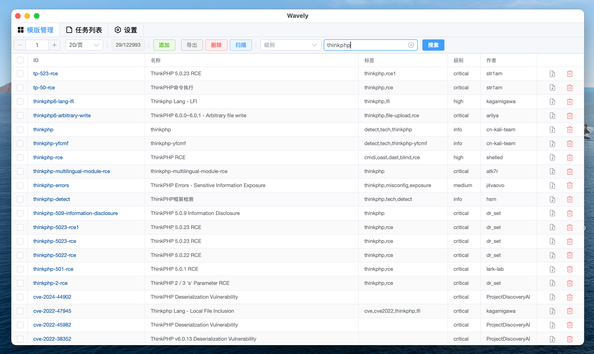
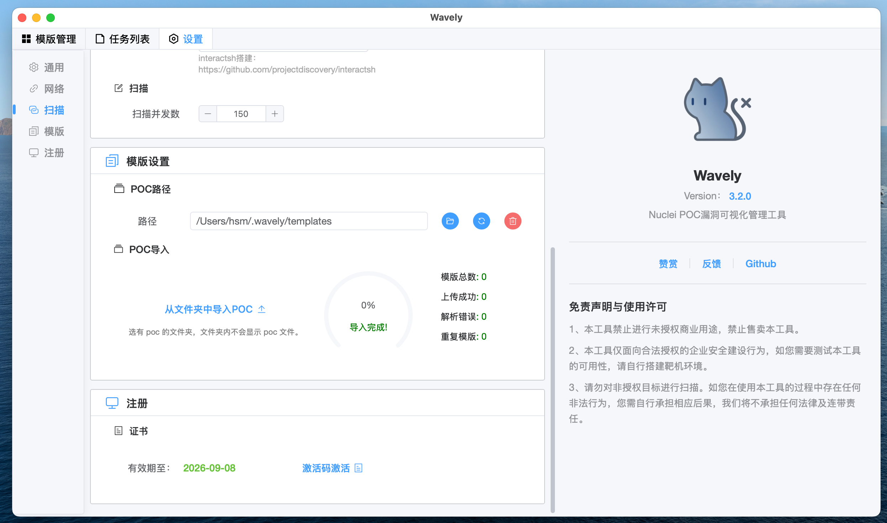

## Wavely - 轻量便捷的Nuclei POC漏洞管理与验证可视化工具
- Wiki（下载与激活）：https://github.com/perlh/Wavely/wiki




## ✨ 功能一览
- [x] **POC 模板管理**：支持对 nuclei POC 模板的增删查改操作
- [x] **跨平台兼容**：已支持 MacOS 和 Windows 系统，Linux 版本测试中
- [x] **多任务扫描**：支持多 POC、多目标批量扫描
- [x] **高级配置**：支持自定义 DNSLOG 服务器、扫描速率控制及多协议网络代理（http/https/socks5）
- [x] **请求分析**：支持查看 POC 匹配时的完整请求/响应数据包
- [x] **编辑器优化**：POC 编辑器支持主题切换和字体大小调整
- [x] **模板导入**：支持一键导入 nuclei 模板，基于 template id 自动去重
- [x] **任务控制**：支持手动停止扫描任务，灵活掌控测试流程
- [x] **配置持久化**：自动保存用户配置，下次启动无需重复设置参数
- [x] **API 测试**：支持对 API 接口及带目录路径的目标进行扫描
- [x] **POC 生成**：提供图形化界面辅助生成简单 POC
- [x] **扫描进度实时显示**：提供可视化进度条展示当前扫描状态
- [x] **扫描结果导出**
- [x] **POC导出（批量导出）** v3.1.7
- [x] **POC生成**：Raw格式时自动解析模版 v3.1.8

## 1、安装
>  **常见问题**：关于使用与安装的常见疑问，可跳转至 [常见问题](#常见问题) 板块查阅。
### 1.1 MacOS 安装
将`Wavely.app`拖移至`Applications`文件夹中。在终端执行：
``` bash
sudo xattr -d com.apple.quarantine /Applications/Wavely.app 
```

### 1.2 Windows 安装步骤
- 下载对应压缩包并解压，执行Wavely-xxx-installer.exe安装程序

###  1.3 DNSLOG 设置说明
- 系统默认采用 Nuclei 默认 DNSLOG 服务。
- 如需搭建个人 Nuclei DNSLOG 服务器，可参考：[搭建指南](https://github.com/projectdiscovery/interactsh) 。


## 2、使用
#### 2.1 注册
Wavely使用注册机制，3.2.0及以上版本与旧版本证书不兼容。若需激活码，可通过以下方式获取：
- 扫描赞赏码并备注您的邮箱（一年有效）；赞赏 50 及以上即可获得永久激活权限，且可免费享受后续所有版本更新。
- 如未及时收到激活码，可通过邮箱：id_0909186@foxmail.com联系。
- Wavely开发过程不易，感谢您的支持！
- 有bug或有新的功能建议可在issue上提出。

#### 2.2 导入 POC
- 点击`从文件夹中导入POC`按钮，选择存放` nuclei poc `文件的目录。



####  2.3 使用

##### 扫描

##### 抓包


##### 全局请求头


## 常见问题
#### Windows 启动时闪现命令框
此为正常现象，不会对 App 功能产生任何影响，可放心使用。
####  Macos 无法打开App
因未使用 Apple 证书签名 App，可能出现解除安全验证提示，如**软件显示禁止符号** 、 **无法验证软件身份** 或 **提示已损坏故不能正常打开** ，可参考以下方案解决：

##### 方案1
在终端执行命令：
``` bash
sudo xattr -d com.apple.quarantine /Applications/Wavely.app
```
##### 方案2
执行命令：
``` bash
chmod 755 /Applications/Wavely.app/Contents/MacOS/Wavely
```


# 免责声明
本工具仅面向合法授权的企业安全建设行为，如您需要测试本工具的可用性，请自行搭建靶机环境。 为避免被恶意使用，本项目所有收录的poc均为漏洞的理论判断，不存在漏洞利用过程，不会对目标发起真实攻击和漏洞利用。 在使用本工具进行检测时，您应确保该行为符合当地的法律法规，并且已经取得了足够的授权。请勿对非授权目标进行扫描。 如您在使用本工具的过程中存在任何非法行为，您需自行承担相应后果，我们将不承担任何法律及连带责任。

## Star History

[](https://star-history.com/#perlh/wavely&Date)

# 捐赠
如果 Wavely 对您帮助很大，您可以通过以下方式支持我们：

### 赞赏码赞助

<!--  -->