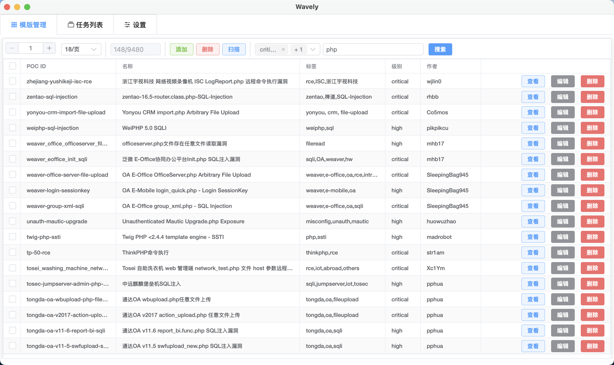
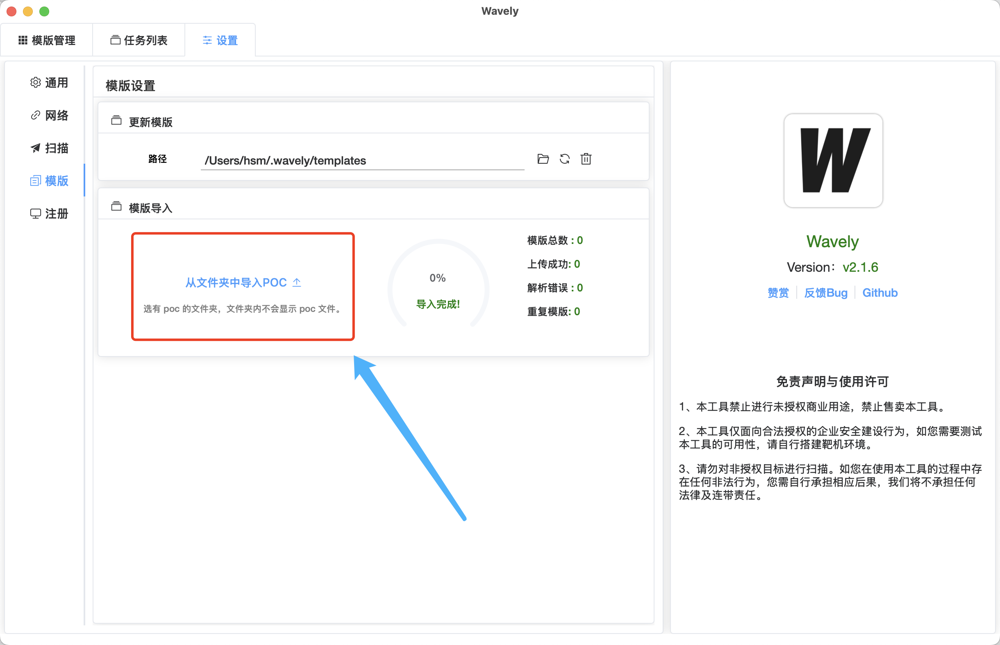

## Wavely - 高效便捷的 Nuclei POC 图形化管理利器

Wavely，一款为 Nuclei POC 管理打造的图形化工具。




1. **安装包获取**：前往下载链接下载安装包，开启高效管理之旅。
2. **捐赠支持**：若 Wavely 助力您提升工作效率，诚邀[捐赠](#捐赠)，您的支持是持续优化的关键动力，深表感谢！
3. **常见问题**：关于使用与安装的常见疑问，可跳转至 [常见问题](#常见问题) 板块查阅。


#### ✨ 功能一览

- [x] 实现对nuclei模板的`添加`、`删除`、`查询`以及`修改`操作。
- [x] 兼容`MacOS`、`Windows`和`Linux`操作系统。
- [x] 实现`选择多个POC`、`多个扫描任务`以及`多目标`的并行扫描功能。
- [x] 支持`自定义DNSLOG服务器`，`自定义扫描速率`，同时`支持http代理（http、https、socks5）`。
- [x] 支持查看 POC 匹配到的`请求包与响应包`。
- [x] 支持 POC 编辑器的`主题切换`。
- [x] 支持nuclei`模板一键导入`(选择POC文件夹即可导入，可实现nuclei模版去重导入，基于template id)。

- [x] 支持`国际化`，已广泛覆盖大部分区域。
- [x] 支持`手动停止扫描`任务，便于灵活控制扫描进程。
- [x] 支持`配置持久化`，确保用户配置信息持久化保存。
- [x] 支持 `API 扫描`，包括带目录扫描（如：http://target.com/api）。
- [x] 支持`图形化生成简单poc`，降低 poc 生成门槛。


## 1、安装指南
#### 1.1 MacOS 安装步骤
1. 下载对应压缩包并解压，解压文件夹内包含`Wavely.app`和`Applications`文件夹。
2. 将`Wavely.app`拖移至`Applications`文件夹中。
3. 在终端执行：`sudo xattr -d com.apple.quarantine /Applications/Wavely.app` 。

#### 1.2 Windows 安装步骤
1. 下载对应压缩包并解压，执行Wavely-xxx-installer.exe安装程序

####  1.3 DNSLOG 设置说明
- 系统默认采用 Nuclei 默认 DNSLOG 服务。
- 如需搭建个人 Nuclei DNSLOG 服务器，可参考：[搭建指南](https://github.com/projectdiscovery/interactsh) 。

## 2、使用教程
#### 2.1 注册
依次点击设置 -> 注册，在注册页面按提示获取设备 ID，完成证书申请后上传证书，即可注册成功。
#### 2.2 导入方法
##### 在 App 中导入 POC（具备去重功能）
- 点击`从文件夹中导入POC`按钮，选择存放` nuclei poc `文件的目录。
- 系统将自动识别并导入所选目录内的所有 POC 文件，导入过程实时显示进度与文件数量，若存在基于 template id 的重复 POC，系统将自动去重，完成后弹窗告知导入结果。



#### 2.3 创建扫描任务流程
##### 任务发起操作
- 选择指定POC后，点击顶部扫描按钮即可启动扫描。
    - 若未选择 POC，系统将对搜索结果执行全扫描；
    - 若已选择 POC，则仅针对所选 POC 进行扫描。
- 此外，点击扫描按钮前，可在任务设置区域自定义扫描速率等参数。


##### 扫描结果查看
- 扫描完成后，点击` POC ID `可直接跳转到` POC 编辑界面，方便进一步分析与调整。


####  2.4 Nuclei 模版编辑 / 添加操作
##### 编辑poc


##### 查看请求 / 响应包（需检测匹配成功）


#####  图形化生成 POC
- **表单形式请求包**：通过直观的表单填写方式。


- **raw 格式请求包**：支持以 raw 格式编辑和生成请求包。


- **测试功能**：生成 POC 后，可点击测试按钮快速验证其有效性。


## 常见问题
#### Windows 启动时闪现命令框
此为正常现象，不会对 App 功能产生任何影响，可放心使用。
####  Macos 无法打开App
因未使用 Apple 证书签名 App，可能出现解除安全验证提示，如**软件显示禁止符号** 、 **无法验证软件身份** 或 **提示已损坏故不能正常打开** ，可参考以下方案解决：

##### 方案1
在终端执行命令：
``` bash
sudo xattr -d com.apple.quarantine /Applications/Wavely.app
```
##### 方案2
执行命令：
``` bash
chmod 755 /Applications/Wavely.app/Contents/MacOS/Wavely
```


# 免责声明
本工具仅面向合法授权的企业安全建设行为，如您需要测试本工具的可用性，请自行搭建靶机环境。 为避免被恶意使用，本项目所有收录的poc均为漏洞的理论判断，不存在漏洞利用过程，不会对目标发起真实攻击和漏洞利用。 在使用本工具进行检测时，您应确保该行为符合当地的法律法规，并且已经取得了足够的授权。请勿对非授权目标进行扫描。 如您在使用本工具的过程中存在任何非法行为，您需自行承担相应后果，我们将不承担任何法律及连带责任。

## Star History

[](https://star-history.com/#perlh/wavely&Date)

# 捐赠
如果 Wavely 对您帮助很大，您可以通过以下方式支持我们：

### 赞赏码赞助

<!--  -->