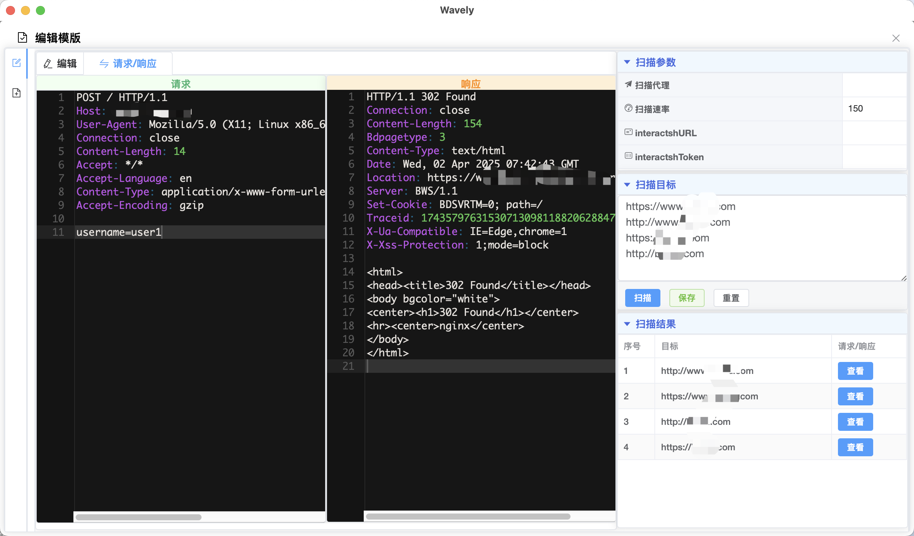
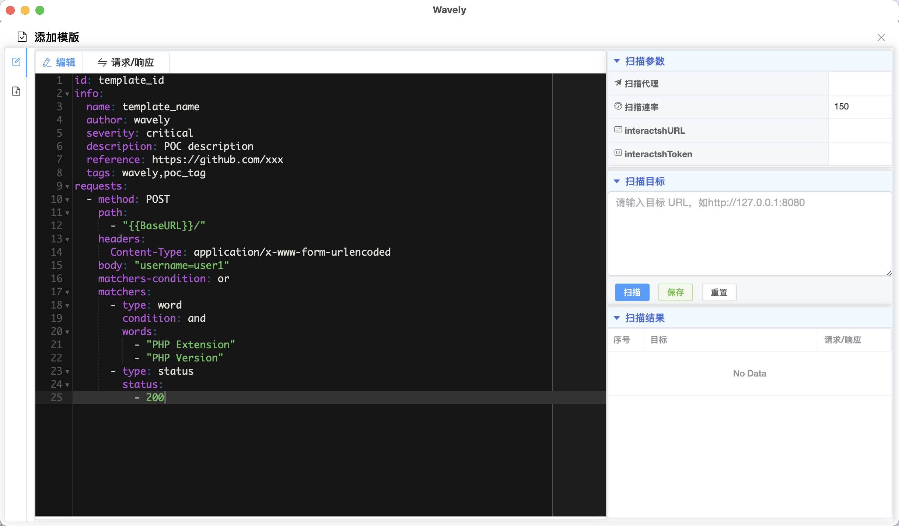

## wavely
## nuclei模版管理工具
由于没找到一款比较好用的poc管理器，便自己开发了这个。
### POC管理器
- 实现nuclei poc管理的桌面应用
- 支持`MacOS`、`Windows`和`Linux`操作系统
- 使用nuclei v3检测引擎
- 兼容yamlv2和yamlv3 nuclei template
- 实现多任务、并行扫描

# 使用
## poc模版导入
### 手动导入
#### macos
对于MacOS和Linux，初次打开App会在家目录生成模版文件夹
``` bash
ls /Users/$USER/.wavely/templates # macos
ls /home/$USER/.wavely/templates    # linux
```
#### windows
会在wavely.exe的同级目录下创建.wavely/templates，将poc放入此文件夹中

#### 导入
如下图所示

### App指定路径导入

### 模版管理


### 扫描
选择thinkphp的poc进行扫描

扫描结果

可复制扫描结果
###  编辑nuclie模版
编辑模版

匹配请求包

匹配响应包

### 添加Nuclei模版


### App设置
主题


代理


扫描


模版导入

## 关于

邮箱：hsmcool@qq.com