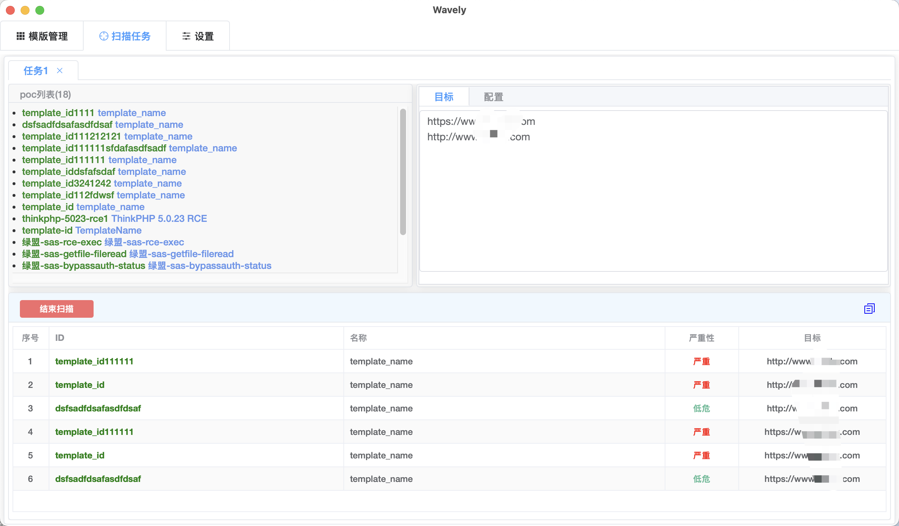

## wavely
### nuclei模版管理工具
由于没找到一款比较好用的poc管理器，，便自己开发了这个，目前仅提供安装包下载。



### ✨ 功能
- [x] 实现 `nuclei` `poc` 管理的桌面应用，对 `nuclei` 模版的增删查改操作
- [x] 支持`MacOS`、`Windows`和`Linux`操作系统
- [x] 实现`选择多个POC`、`多个扫描任务`和`多目标`并行扫描
- [x] 支持自定义 `DNSLOG服务器`，支持`自定义扫描速率`和支持`http代理`（http、https、socks5）
- [x] 支持查看 POC 匹配到的请求包和响应包
- [x] 使用全新`nuclei v3`检测引擎，兼容 yamlv2 和 yamlv3 nuclei template
- [x] 支持 **POC 编辑器**主题切换
- [x] 支持多种 `nuclei` 模版导入方式
- [x] 支持 `nuclei` 模版去重导入
- [x] 支持国际化（支持**简体中文**和**英文**）
- [x] 支持手动停止扫描任务
- [x] 支持配置持久化
- [x] 支持API扫描（支持带目录扫描，如：http://target.com/api）

## 安装
#### MacOS
1. 下载相应压缩包并解压，解压文件夹中包含 `Wavely.app`和 `Applications文件夹`。
2. 将`Wavely.app`拖到`Applications文件夹`中
3. 终端执行:`sudo xattr -d com.apple.quarantine /Applications/Wavely.app`

#### Windows
-  使用 `Wavely-amd64-installer.exe.zip` 安装程序进行安装


### POC导入
##### 在App中导入POC（带POC去重）
- 点击`从文件夹中导入`按钮，选择`nuclei poc文件目录`。


### 快速使用

以扫描thinkphp漏洞为例
##### 1、搜索 POC 并扫描
- 不选择poc，则对搜索结果进行全扫描
- 选择poc后，则对选择的poc进行扫描


##### 2、添加目标
- 按行添加目标


##### 3、扫描结果
- 点击POC ID可跳转到POC编辑界面


#####  4、POC测试
- 对于测试匹配到的POC，可显示请求响应包


##### 5、添加Nuclei模版


##### 6、App设置
###### 通用设置
1. 可切换POC编辑器主题
2. 选择语言


###### 网络设置
- 添加HTTP代理


###### 扫描设置
- POC扫描参数设置
- 设置扫描并发数


###### 模版设置
- 更新数据库
- 导入模版


### 常见问题
##### Windows启动时闪现弹出命令框
为正常现象，不影响App的功能
#####  Macos 无法打开App
由于没有使用apple证书签名app，可能会提示解除安全验证：`软件显示禁止符号` 或 `无法验证软件身份` 或 `提示已损坏故不能正常打开`，请参考：

##### 方案1
执行如下命令即可：
``` bash
sudo xattr -d com.apple.quarantine Applications/Wavely.app
```
##### 方案2
``` bash
chmod 755 /Users/$USER/Desktop/Wavely_darwin_arm64_1.5.2.app/Contents/MacOS/Wavely
```

# 免责声明
本工具仅面向合法授权的企业安全建设行为，如您需要测试本工具的可用性，请自行搭建靶机环境。 为避免被恶意使用，本项目所有收录的poc均为漏洞的理论判断，不存在漏洞利用过程，不会对目标发起真实攻击和漏洞利用。 在使用本工具进行检测时，您应确保该行为符合当地的法律法规，并且已经取得了足够的授权。请勿对非授权目标进行扫描。 如您在使用本工具的过程中存在任何非法行为，您需自行承担相应后果，我们将不承担任何法律及连带责任。

## Star History

[](https://star-history.com/#perlh/wavely&Date)

# 捐赠
如果 Wavely 对您帮助很大，您可以通过以下方式支持我们：

### 赞赏码赞助
