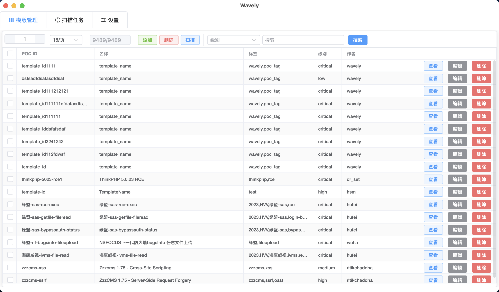

## wavely
## nuclei模版管理工具
由于没找到一款比较好用的poc管理器，便自己开发了这个，仅提供下载安装包。待相关功能完备之后，或许会将该项目以开源的形式发布。

## ✨ 功能
- [x] 实现nuclei poc管理的桌面应用，对nuclei模版的增删查改操作
- [x] 支持查看nuclei模版请求响应包
- [x] 支持`MacOS`、`Windows`和`Linux`操作系统
- [x] 使用全新`nuclei v3`检测引擎
- [x] 兼容`yamlv2`和`yamlv3` nuclei template
- [x] 实现多任务、并行扫描
- [x] 支持使用自建的nuclei DNSLOG服务器
- [x] 支持`http代理`（http、https、socks5）
- [x] 支持主题切换
- [x] 支持多种nuclei模版导入方式


# 快速使用

## POC模版导入
#### POC模版保存路径
#### 1. macos
对于MacOS和Linux，初次打开App会在家目录生成模版文件夹
``` bash
ls /Users/$USER/.wavely/templates # macos
ls /home/$USER/.wavely/templates    # linux
```
#### 2. windows
会在wavely.exe的同级目录下创建`.wavely/templates`，将POC放入此文件夹中（请开启显示隐藏文件/文件夹）
### 手动导入
将自己的nuclei POC文件导入到App的`POC模版保存路径`下,点击更新按钮，将初始化数据库
> 这样导入的话，会将poc原封不动的导入到app中，不会进行POC去重

如下图所示


#### App指定路径导入
1. ***从文件夹中导入***（选择保存poc的文件夹，将poc复制到app的模版路径中，得到去重之后的poc）
2. ***从文件中导入***（选择poc文件，将poc复制到app的模版路径中）


### 模版管理

### 扫描
选择thinkphp的poc进行扫描

扫描结果

可复制扫描结果
###  编辑nuclie模版
编辑模版

匹配请求包

匹配响应包

### 添加Nuclei模版


### App设置
主题


代理


扫描


模版导入


## 常见问题
1. Macos 无法打开App
> 由于没有使用apple证书签名app，故不能正常打开，需要手动允许App允许，请参考
https://support.apple.com/zh-tw/guide/mac-help/mh40616/14.0/mac/14.0


# 免责声明
本工具仅面向合法授权的企业安全建设行为，如您需要测试本工具的可用性，请自行搭建靶机环境。 为避免被恶意使用，本项目所有收录的poc均为漏洞的理论判断，不存在漏洞利用过程，不会对目标发起真实攻击和漏洞利用。 在使用本工具进行检测时，您应确保该行为符合当地的法律法规，并且已经取得了足够的授权。请勿对非授权目标进行扫描。 如您在使用本工具的过程中存在任何非法行为，您需自行承担相应后果，我们将不承担任何法律及连带责任。