### DNSLog 配置说明
- 默认使用 Nuclei 官方 Interactsh 服务（无需额外配置）
- 如需使用私有 DNSLog，请参考官方搭建指南：
👉 [Interactsh 搭建文档](https://github.com/projectdiscovery/interactsh)

## 3、基本使用
POC管理页面

POC任务扫描页面

POC添加

模版编辑

抓包工具
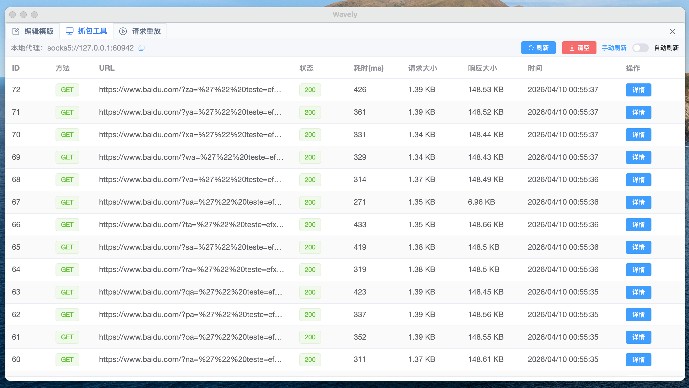
请求重放
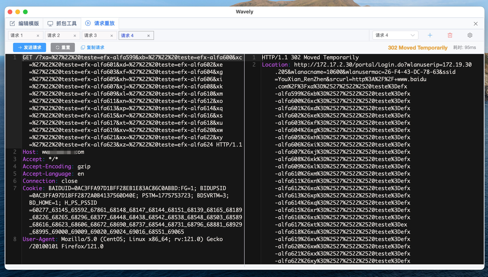
工具箱

设置页面

POC远程管理页面

POC管理设置页面

连接POC共享库时，右上角会有标记

左侧可以对标签、作者进行分类，方便快速筛选

高级搜索支持不包含字段

扫描任务支持快捷参数设置，支持设置全局请求头

请求/响应详情，支持记录单个POC发出的所有http请求响应

激活输入框

#### 3.2 导入 POC
- 将包含 POC 的文件夹直接拖拽至主窗口，即可批量导入

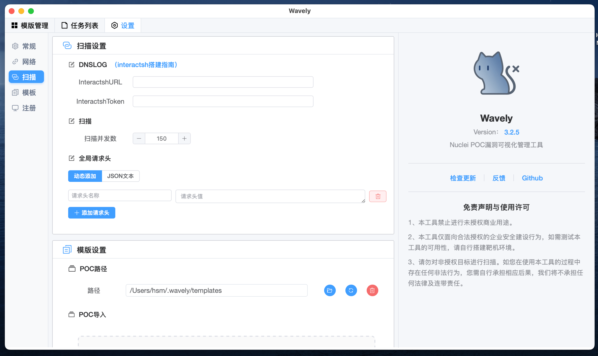
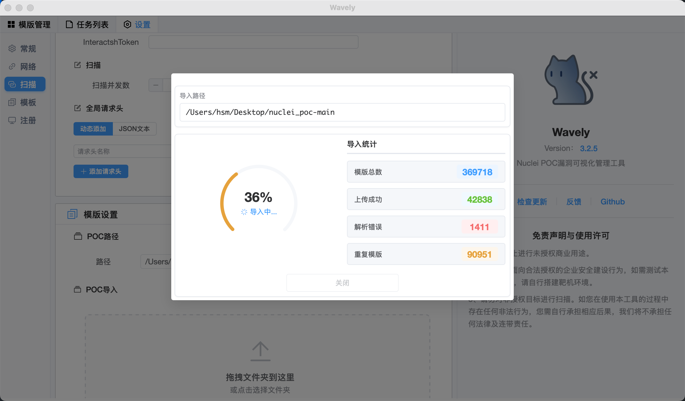

#### 3.3 添加 POC

#### 3.4 编辑 POC
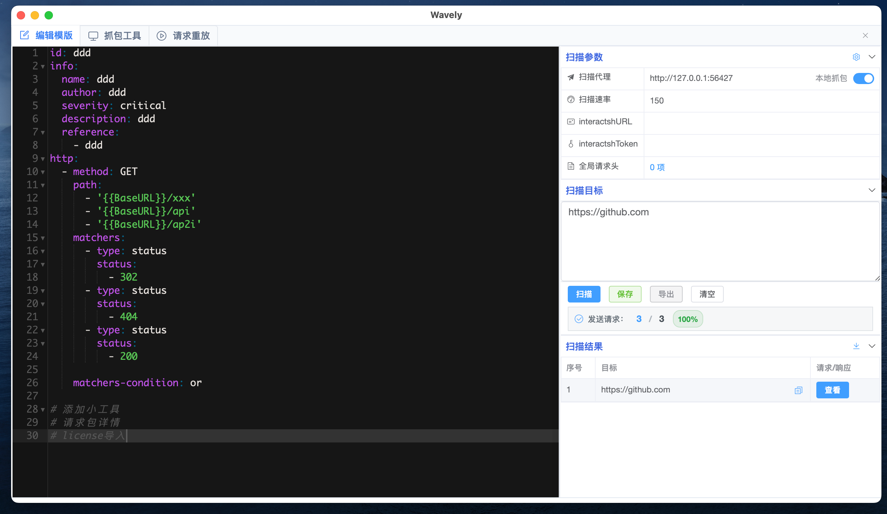
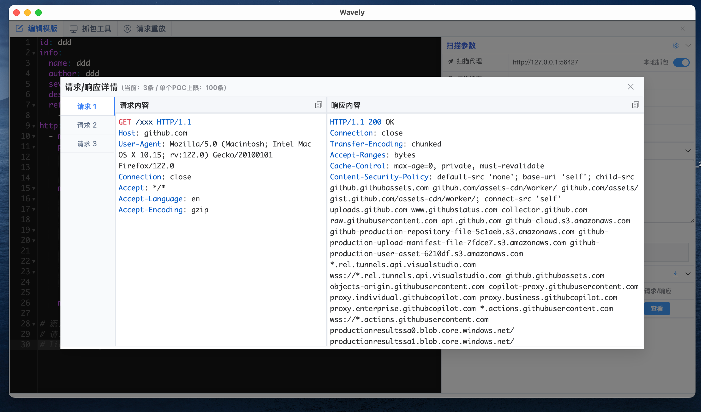

#### 3.5 任务列表
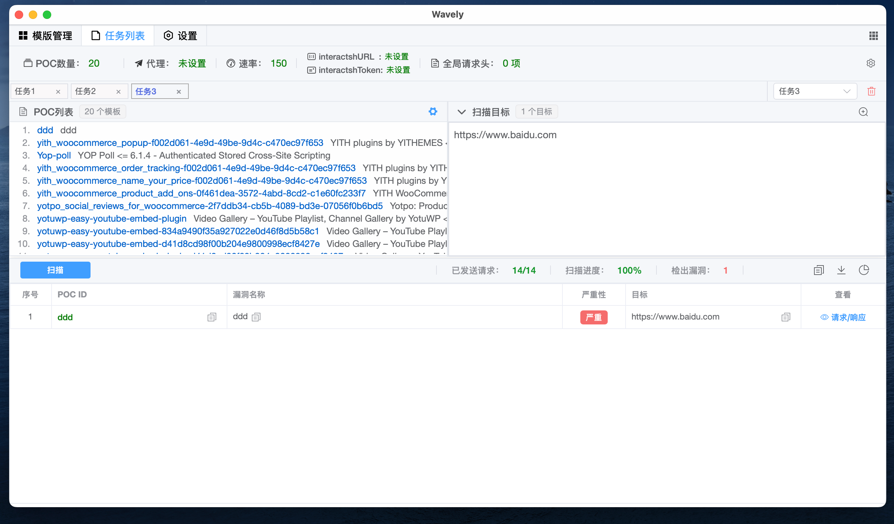
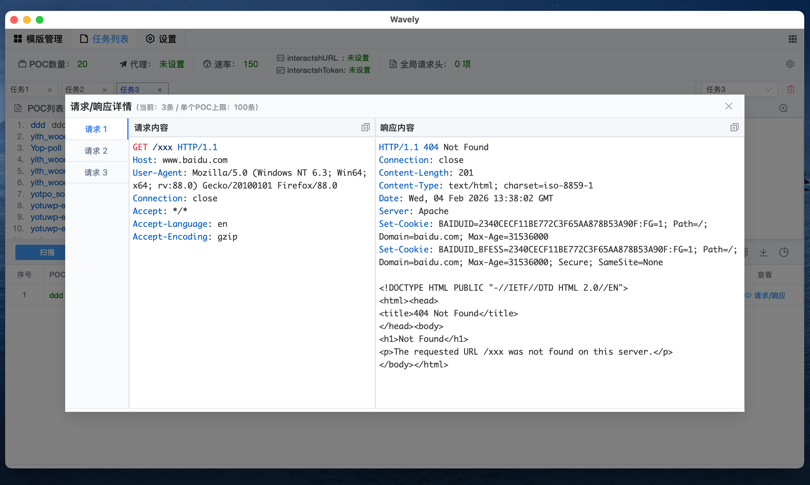

#### 3.6 抓包工具
- 抓包管理

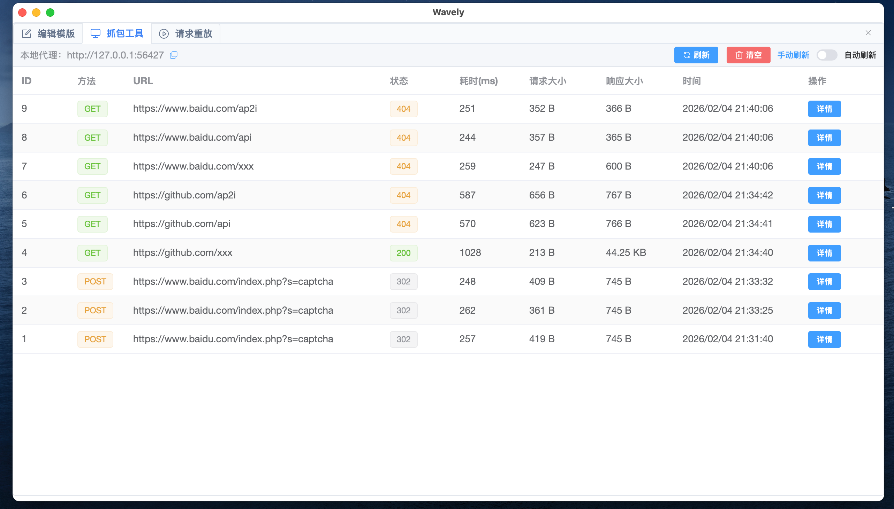

- 抓包详情

#### 3.7 请求包重放

#### 3.8 全局请求头
- 配置界面

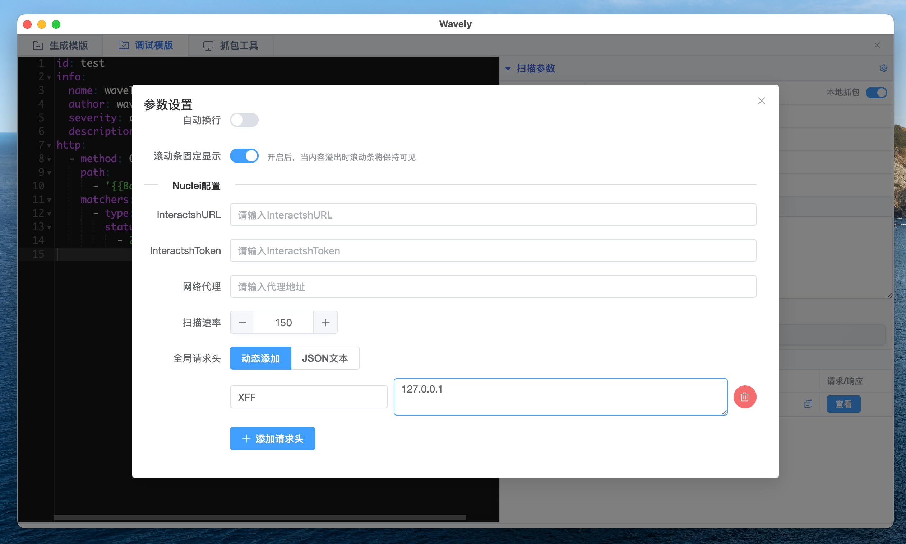
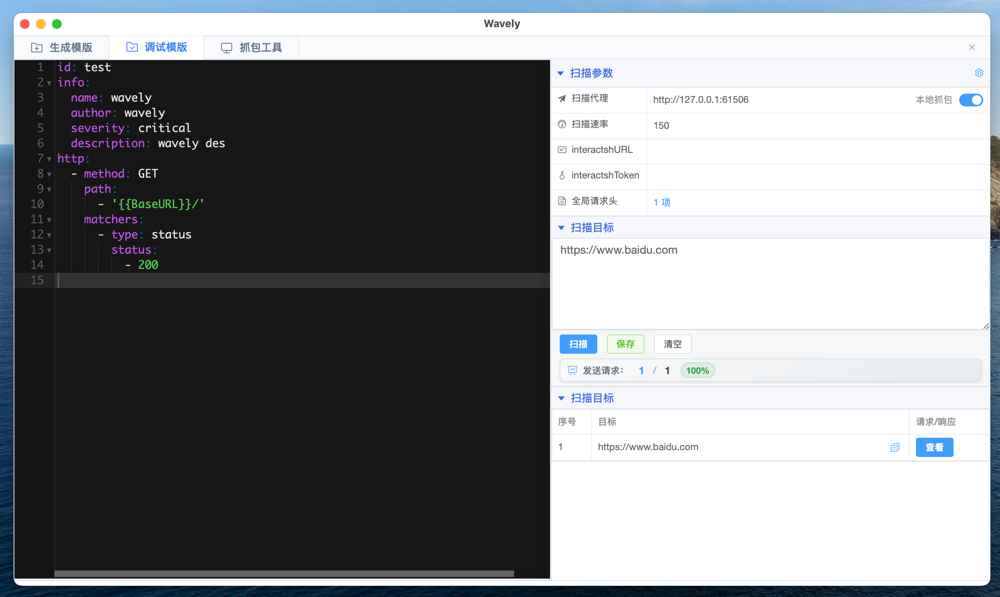

- 详细设置

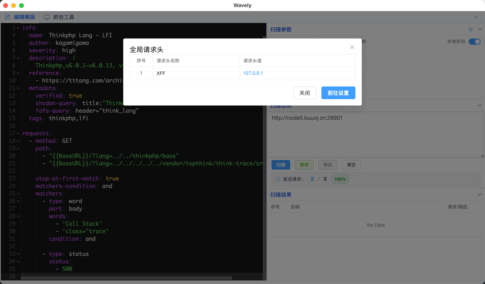

#### POC 共享服务
- 用于将本机 POC 通过服务方式共享给团队中其他使用 Wavely 的成员，便于统一维护和复用 POC。
- 开启共享服务后，本机将作为「POC 服务端」，其他成员可通过「POC 接入管理」添加并使用本机提供的 POC 库。

1. **在 Wavely 客户端开启共享服务**
   - 在主界面打开「POC 共享服务」入口，勾选或点击开关启用服务。
   - 设置对外暴露的监听地址与端口（如 `0.0.0.0:8081`，或仅绑定内网 IP）。
   - 可选择共享的 POC 范围（全部 POC、指定标签、指定作者等），避免将实验性或敏感 POC 暴露给所有人。

   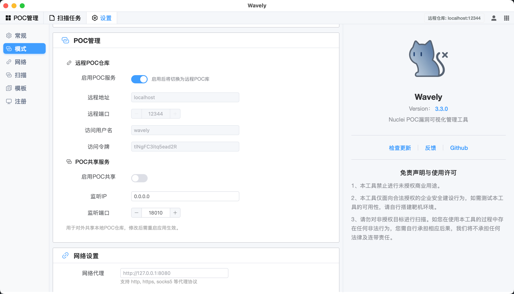

2. **通过 `Wavely-server` 运行 POC 共享服务（可选）**
   - 可运行命令行版 `Wavely-server` 作为 POC 共享服务端（适用于服务器部署或无人值守场景），支持 Windows / macOS / Linux。
   - 建议在内网环境使用，并通过防火墙或网段控制访问范围。
   - 如需限制访问者，可配置访问密钥/令牌，仅允许已授权客户端接入。
   - 关闭共享服务后，现有连接将自动失效，其他客户端将无法继续同步 POC。

   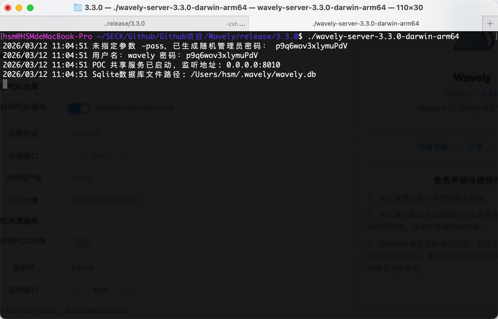

#### POC 接入管理（客户端连接远程 POC 服务）

1. **添加远程 POC 服务**
   - 点击「设置」→「模式」→「POC 管理」，进入「POC 接入管理」页面。
   - 点击「新增服务 / 添加节点」，填写远程服务地址（如 `http://192.168.1.10:8081`）与访问密钥（如有）。
   - 启用后连接成功，右上角会显示「远程仓库：xxxx」。
   - 远程 POC 服务管理：点击右上角用户图标进入「用户管理」页面。

   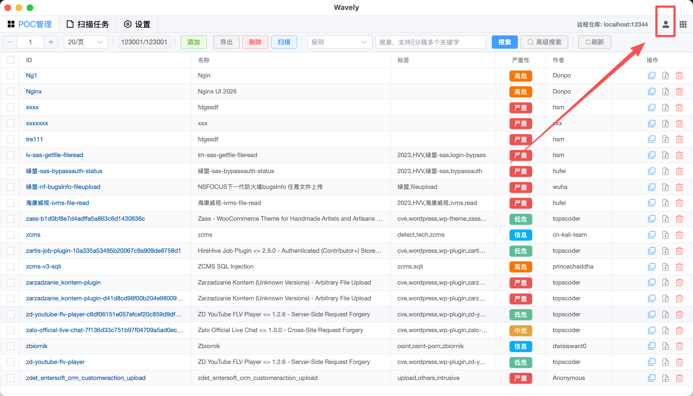

2. **用户管理模块说明**
   - **远程 POC 概览**：远程与本地 POC 库概览；支持将远程 POC 合并到本地、下载远程 POC 库等。
   - **提交管理**：普通用户的提交记录与审核状态（例如新增/修改 POC 的申请是否通过）。
   - **远程推送管理**：远程 POC 库管理员用于审核普通用户的提交申请（新增/修改/删除 POC 等）。
   - **本地推送管理**：当你使用本地 Wavely 进行 POC 共享时，用于审核普通用户的提交申请（新增/修改/删除 POC 等）。
   - **远程用户管理**：远程 POC 库管理员用于管理接入用户权限。
   - **本地用户管理**：当你使用本地 Wavely 进行 POC 共享时，用于管理接入用户权限。
